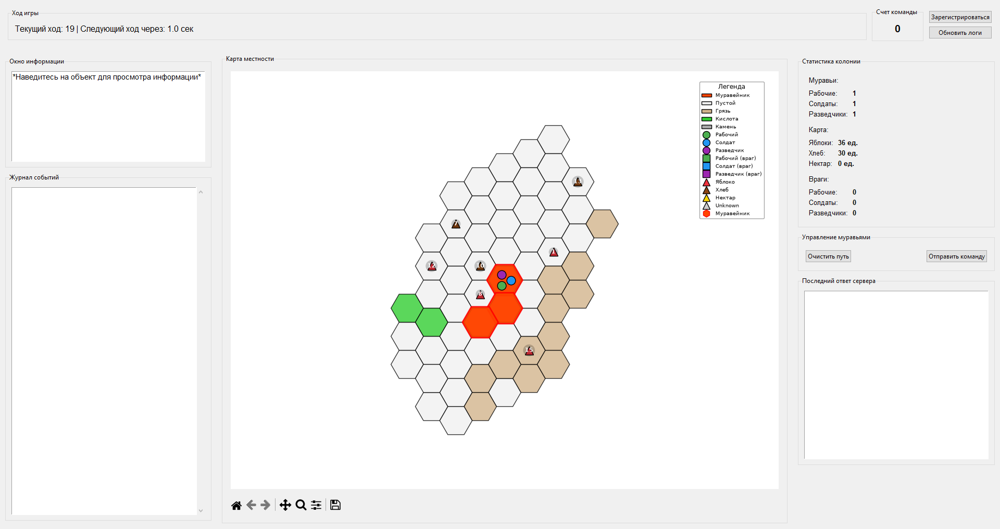
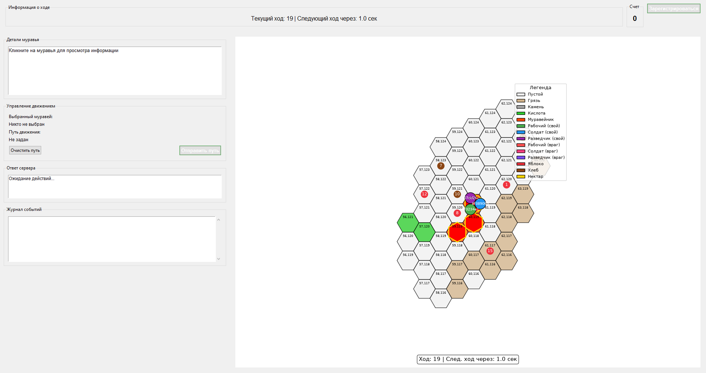

# DatsPulse client

Operator console for **DatsPulse**, a hex-grid strategy contest run by DatsTeam in July 2025.
Each team controls an ant colony through an HTTP API: the server advances a turn every second or
so, and a client polls the arena, decides where the ants should walk, and posts the moves back.

This repository is what I built during the contest to actually see the board — three iterations of a
control panel, two in tkinter and one in the browser.

> **No autonomous strategy here.** Paths are drawn by hand — click an ant, click the hexes it should
> walk through, press *Отправить команду*. The clients are eyes and hands, not a bot.

<p align="center">
  
</p>

## The game, as the code understands it

The type tables in [`ants_game.py`](ants_game.py) are effectively the rulebook this client was
written against:

| Ant | HP | Damage | Carry | Vision | Speed | Spawn chance |
|---|---|---|---|---|---|---|
| Worker | 130 | 30 | 8 | 1 | 5 | 60 % |
| Soldier | 180 | 70 | 2 | 1 | 4 | 30 % |
| Scout | 80 | 20 | 2 | 4 | 7 | 10 % |

| Hex | Move cost | Note |
|---|---|---|
| Anthill | 1 | where food is delivered |
| Empty | 1 | |
| Dirt | 2 | |
| Acid | 1 | 20 damage at end of turn |
| Stone | ∞ | impassable |

Food is worth 10 (apple), 20 (bread) or 60 (nectar) units of saturation, so a scout that finds
nectar is worth more than a worker hauling apples.

The API is four endpoints: `POST /register`, `GET /arena`, `GET /logs`, `POST /move`.

## What is in here

| | |
|---|---|
| [`ants_game.py`](ants_game.py) | The client I ended up using. Hex map with the whole colony, per-entity hover info, colony statistics, event log, click-to-plan paths, batch move submission. |
| [`ants_viewer.py`](ants_viewer.py) | The first evening's client. Fewer panels, and it plans a path for one ant at a time, but it draws hex coordinates on the board and implements its own scroll-zoom and drag-pan instead of leaning on the matplotlib toolbar. |
| [`web/`](web) | Browser rewrite started at the end of the contest: canvas hex map, stats and logs over the same API. Reads the arena, never got move submission finished. |
| [`fixtures/arena_turn19.json`](fixtures/arena_turn19.json) | A real `/arena` response captured mid-game — turn 19, three ants, 61 hexes, seven food piles. |

## Running

```bash
pip install -r requirements.txt
python ants_game.py --offline
```

`--offline` renders the captured arena from `fixtures/` instead of calling the server, so the client
runs with no token and no network — that is the screenshot above.

To point it at a live game, copy `config_sample.py` to `config.py`, put your token in it, and drop
the flag:

```bash
python ants_game.py
```

`ants_viewer.py` takes the same `--offline` flag:

<p align="center">
  
</p>

The browser client is static — open `web/index.html` and it will ask for the token once and keep it
in `localStorage`. Note it targets the production host (`games.datsteam.dev`) while both Python
clients target the test host (`games-test.datsteam.dev`).

## Known limitations

- Manual control only. With a one-second turn and paths clicked out by hand, the colony was managed
  a few ants at a time — that ceiling is the honest result of the weekend.
- Three clients rather than one. Each rewrite started from a blank file instead of refactoring the
  previous one, so hex geometry, drawing and API calls are implemented three times over.
- `web/` never got `postMove` implemented, so it can watch a game but not play one.
- Bootstrap and the Rubik font family are vendored into `web/` rather than pulled from a CDN.
